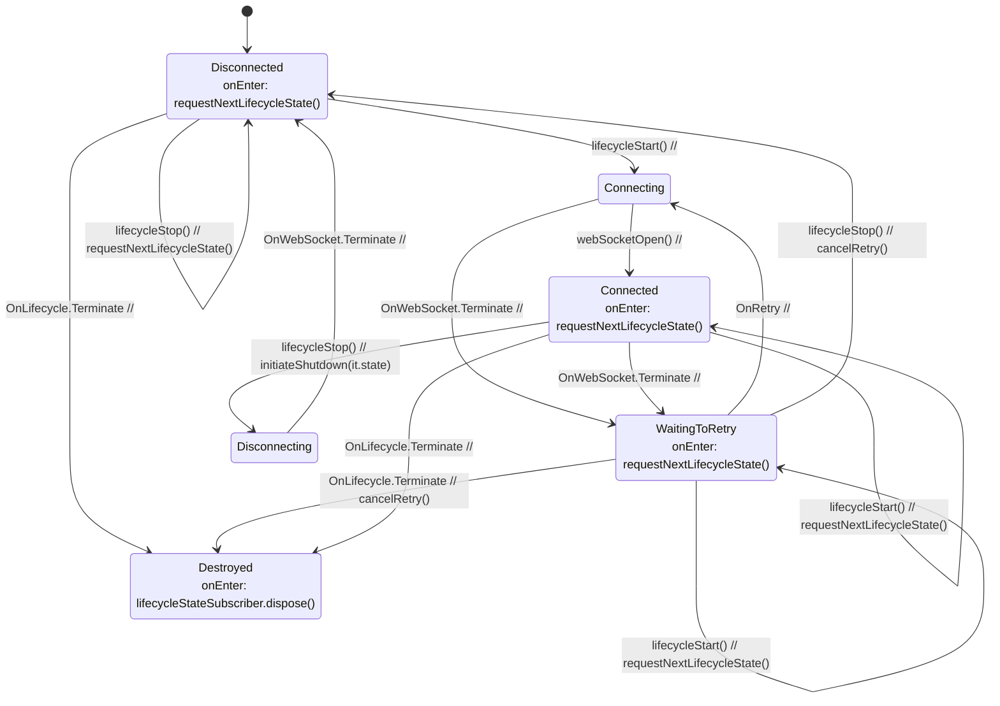

# Moorelangelo
State machine visualization tool with support for [Tinder/StateMachine](https://github.com/tinder/statemachine) (Kotlin).

The name is a portmanteau of the father of automata, Edward F. Moore, and the renaissance artist Michelangelo.

## Sample input
Taken from here: https://github.com/Tinder/Scarlet/blob/121ae9b0f402032d5a9912a05e6e24773ab3171d/scarlet/src/main/java/com/tinder/scarlet/internal/connection/Connection.kt#L23
```kotlin
package org.luqasn.stateviz

internal class StateManager(
    val lifecycle: Lifecycle,
    private val webSocketFactory: WebSocket.Factory,
    private val backoffStrategy: BackoffStrategy,
    private val scheduler: Scheduler
) {
    val state: State
        get() = stateMachine.state

    private val lifecycleStateSubscriber = LifecycleStateSubscriber(this)
    private val eventProcessor = PublishProcessor.create<Event>()
    private val stateMachine = StateMachine.create<State, Event, SideEffect> {
        state<Disconnected> {
            onEnter {
                requestNextLifecycleState()
            }
            on(lifecycleStart()) {
                val webSocketSession = open()
                transitionTo(Connecting(session = webSocketSession, retryCount = 0))
            }
            on(lifecycleStop()) {
                // No-op
                requestNextLifecycleState()
                dontTransition()
            }
            on<OnLifecycle.Terminate>() {
                transitionTo(Destroyed)
            }
        }
        state<WaitingToRetry> {
            onEnter {
                requestNextLifecycleState()
            }
            on<OnRetry> {
                val webSocketSession = open()
                transitionTo(Connecting(session = webSocketSession, retryCount = retryCount + 1))
            }
            on(lifecycleStart()) {
                // No-op
                requestNextLifecycleState()
                dontTransition()
            }
            on(lifecycleStop()) {
                cancelRetry()
                transitionTo(Disconnected)
            }
            on<OnLifecycle.Terminate>() {
                cancelRetry()
                transitionTo(Destroyed)
            }
        }
        state<Connecting> {
            on(webSocketOpen()) {
                transitionTo(Connected(session = session))
            }
            on<OnWebSocket.Terminate>() {
                val backoffDuration = backoffStrategy.backoffDurationMillisAt(retryCount)
                val timerDisposable = scheduleRetry(backoffDuration)
                transitionTo(
                    WaitingToRetry(
                        timerDisposable = timerDisposable,
                        retryCount = retryCount,
                        retryInMillis = backoffDuration
                    )
                )
            }
        }
        state<Connected> {
            onEnter {
                requestNextLifecycleState()
            }
            on(lifecycleStart()) {
                // No-op
                requestNextLifecycleState()
                dontTransition()
            }
            on(lifecycleStop()) {
                initiateShutdown(it.state)
                transitionTo(Disconnecting)
            }
            on<OnLifecycle.Terminate> {
                session.webSocket.cancel()
                transitionTo(Destroyed)
            }
            on<OnWebSocket.Terminate>() {
                val backoffDuration = backoffStrategy.backoffDurationMillisAt(0)
                val timerDisposable = scheduleRetry(backoffDuration)
                transitionTo(
                    WaitingToRetry(
                        timerDisposable = timerDisposable,
                        retryCount = 0,
                        retryInMillis = backoffDuration
                    )
                )
            }
        }
        state<Disconnecting> {
            on<OnWebSocket.Terminate> {
                transitionTo(Disconnected)
            }
        }
        state<Destroyed> {
            onEnter {
                lifecycleStateSubscriber.dispose()
            }
        }
        initialState(Disconnected)
        onTransition { transition ->
            transition.let {
                if (it is Valid && it.fromState != it.toState) {
                    eventProcessor.onNext(Event.OnStateChange(state))
                }
            }
        }
    }

    fun observeEvent(): Flowable<Event> = eventProcessor.onBackpressureBuffer()

    fun subscribe() {
        lifecycle.subscribe(lifecycleStateSubscriber)
    }

    fun handleEvent(event: Event) {
        eventProcessor.onNext(event)
        stateMachine.transition(event)
    }

    private fun open(): Session {
        val webSocket = webSocketFactory.create()
        val subscriber = WebSocketEventSubscriber(this)
        Flowable.fromPublisher(webSocket.open())
            .observeOn(scheduler)
            .cast(WebSocket.Event::class.java)
            .subscribe(subscriber)
        return Session(webSocket, subscriber)
    }

    private fun scheduleRetry(duration: Long): Disposable {
        val retryTimerScheduler = RetryTimerSubscriber(this)
        Flowable.timer(duration, TimeUnit.MILLISECONDS, scheduler)
            .onBackpressureBuffer()
            .subscribe(retryTimerScheduler)
        return retryTimerScheduler
    }

    private fun requestNextLifecycleState() = lifecycleStateSubscriber.requestNext()

    private fun Connected.initiateShutdown(state: Lifecycle.State) {
        when (state) {
            is Lifecycle.State.Stopped.WithReason -> session.webSocket.close(state.shutdownReason)
            Lifecycle.State.Stopped.AndAborted -> session.webSocket.cancel()
        }
    }

    private fun WaitingToRetry.cancelRetry() = timerDisposable.dispose()

    private fun lifecycleStart() =
        any<Event, Event.OnLifecycle.StateChange<*>>().where { state == Lifecycle.State.Started }

    private fun lifecycleStop() =
        any<Event, Event.OnLifecycle.StateChange<*>>().where { state is Lifecycle.State.Stopped }

    private fun webSocketOpen() = any<Event, Event.OnWebSocket.Event<*>>()
        .where { event is WebSocket.Event.OnConnectionOpened<*> }
}
```

## Output

